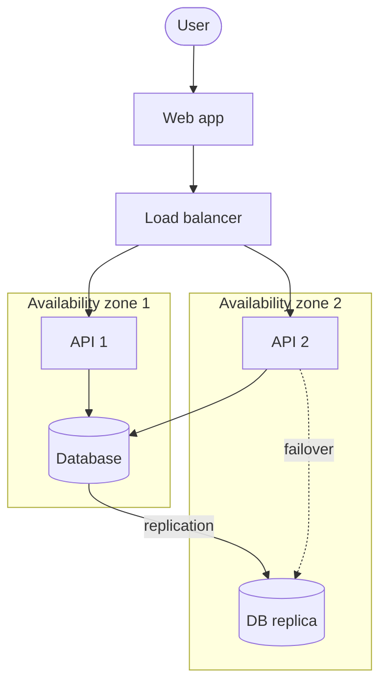

# Example minimal diagram

```mermaid
flowchart TD
    User([User]) --> App[Web app]
    App --> LB[Load balancer]
    subgraph AZ1[Availability zone 1]
        API1[API 1]
        DB[(Database)]
    end
    subgraph AZ2[Availability zone 2]
        API2[API 2]
        Replica[(DB replica)]
    end
    LB --> API1
    LB --> API2
    API1 --> DB
    API2 --> DB
    DB -- replication --> Replica
    API2 -. failover .-> Replica
```
