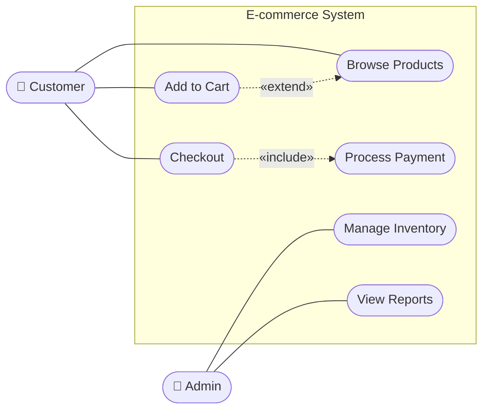

# E-commerce use case diagram

```mermaid
flowchart LR
    Customer(["👤 Customer"])
    Admin(["👤 Admin"])

    subgraph ECS["E-commerce System"]
        direction TB
        BrowseProducts(["Browse Products"])
        AddToCart(["Add to Cart"])
        Checkout(["Checkout"])
        ProcessPayment(["Process Payment"])
        ManageInventory(["Manage Inventory"])
        ViewReports(["View Reports"])
    end

    Customer --- BrowseProducts
    Customer --- AddToCart
    Customer --- Checkout

    Admin --- ManageInventory
    Admin --- ViewReports

    AddToCart -. "«extend»" .-> BrowseProducts
    Checkout -. "«include»" .-> ProcessPayment
```
