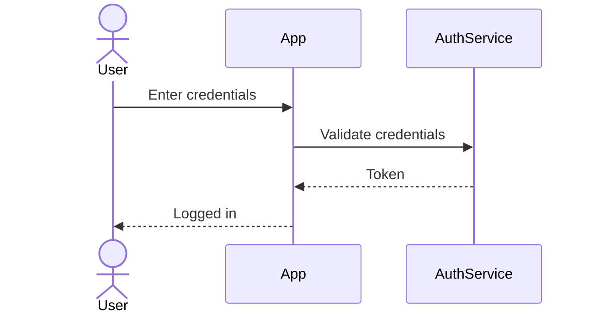
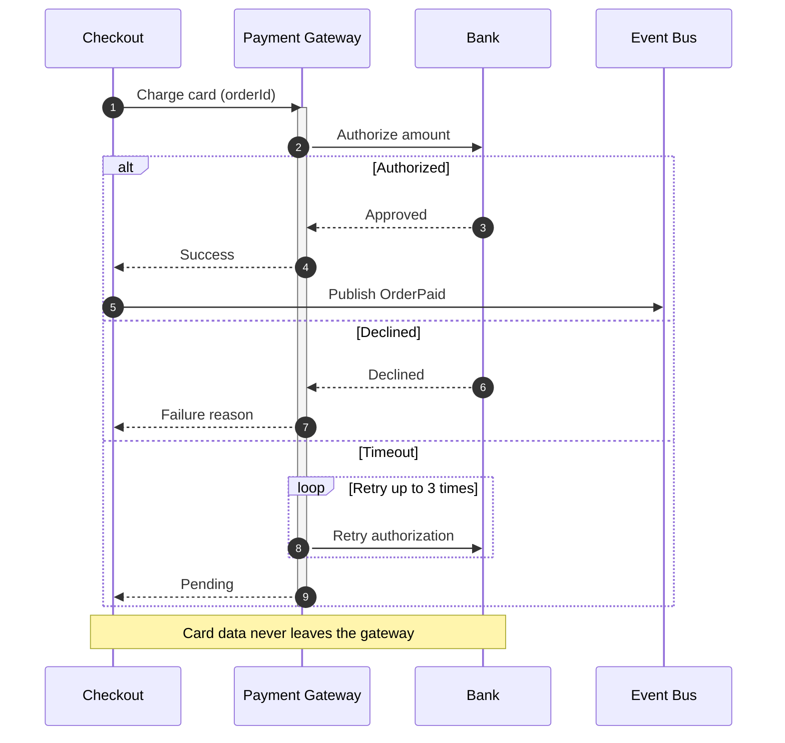

# Sequence Diagram

Sequence diagrams show interactions between participants over time.

## Simple example: login request

```mermaid
sequenceDiagram
    actor User
    participant App
    participant AuthService
    User->>App: Enter credentials
    App->>AuthService: Validate credentials
    AuthService-->>App: Token
    App-->>User: Logged in
```

## Complex example: payment with retry and alternatives

```mermaid
sequenceDiagram
    autonumber
    participant Shop as Checkout
    participant Payment as Payment Gateway
    participant Bank
    participant Queue as Event Bus

    Shop->>Payment: Charge card (orderId)
    activate Payment
    Payment->>Bank: Authorize amount
    alt Authorized
        Bank-->>Payment: Approved
        Payment-->>Shop: Success
        Shop->>Queue: Publish OrderPaid
    else Declined
        Bank-->>Payment: Declined
        Payment-->>Shop: Failure reason
    else Timeout
        loop Retry up to 3 times
            Payment->>Bank: Retry authorization
        end
        Payment-->>Shop: Pending
    end
    deactivate Payment
    Note over Shop,Bank: Card data never leaves the gateway
```
