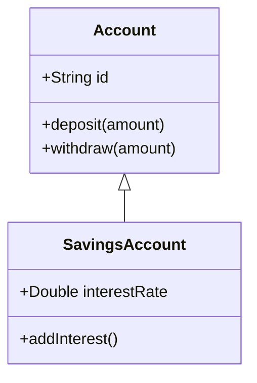
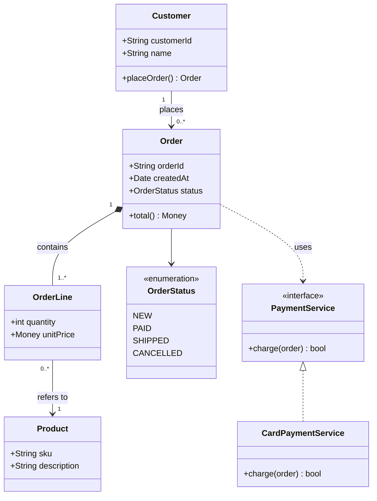

# Class Diagram

Class diagrams show classes, their attributes, methods, and relationships.

## Simple example: account inheritance

```mermaid
classDiagram
    class Account {
        +String id
        +deposit(amount)
        +withdraw(amount)
    }
    class SavingsAccount {
        +Double interestRate
        +addInterest()
    }
    Account <|-- SavingsAccount
```

## Complex example: order domain model

```mermaid
classDiagram
    class Customer {
        +String customerId
        +String name
        +placeOrder() Order
    }
    class Order {
        +String orderId
        +Date createdAt
        +OrderStatus status
        +total() Money
    }
    class OrderLine {
        +int quantity
        +Money unitPrice
    }
    class Product {
        +String sku
        +String description
    }
    class OrderStatus {
        <<enumeration>>
        NEW
        PAID
        SHIPPED
        CANCELLED
    }
    class PaymentService {
        <<interface>>
        +charge(order) bool
    }
    class CardPaymentService {
        +charge(order) bool
    }

    Customer "1" --> "0..*" Order : places
    Order "1" *-- "1..*" OrderLine : contains
    OrderLine "0..*" --> "1" Product : refers to
    Order --> OrderStatus
    PaymentService <|.. CardPaymentService
    Order ..> PaymentService : uses
```
