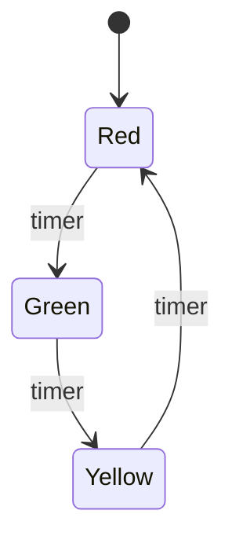
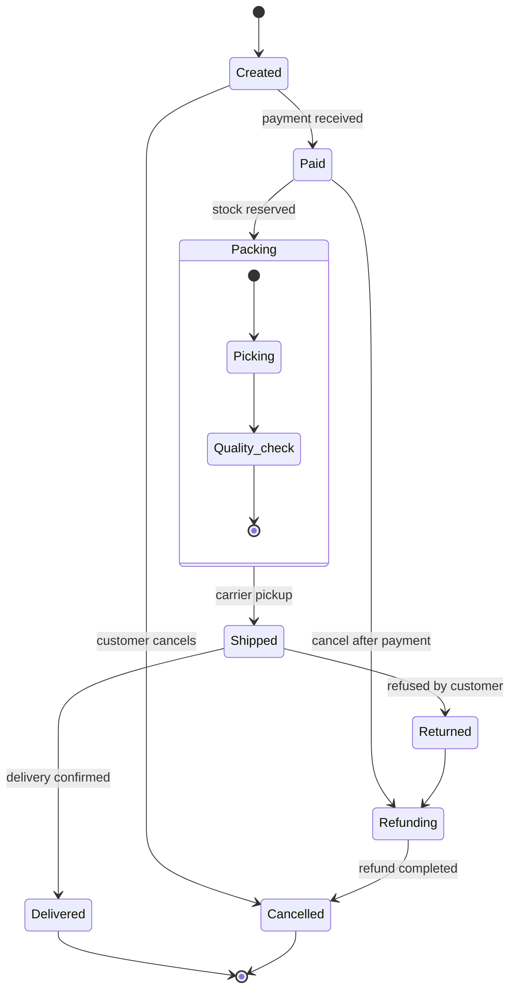

# State Diagram

State diagrams show the states an entity can be in and the transitions between them.

## Simple example: traffic light

```mermaid
stateDiagram-v2
    [*] --> Red
    Red --> Green : timer
    Green --> Yellow : timer
    Yellow --> Red : timer
```

## Complex example: order lifecycle

```mermaid
stateDiagram-v2
    [*] --> Created
    Created --> Paid : payment received
    Created --> Cancelled : customer cancels
    Paid --> Packing : stock reserved
    Paid --> Refunding : cancel after payment
    Packing --> Shipped : carrier pickup
    Shipped --> Delivered : delivery confirmed
    Shipped --> Returned : refused by customer
    Returned --> Refunding
    Refunding --> Cancelled : refund completed
    Delivered --> [*]
    Cancelled --> [*]

    state Packing {
        [*] --> Picking
        Picking --> Quality_check
        Quality_check --> [*]
    }
```
