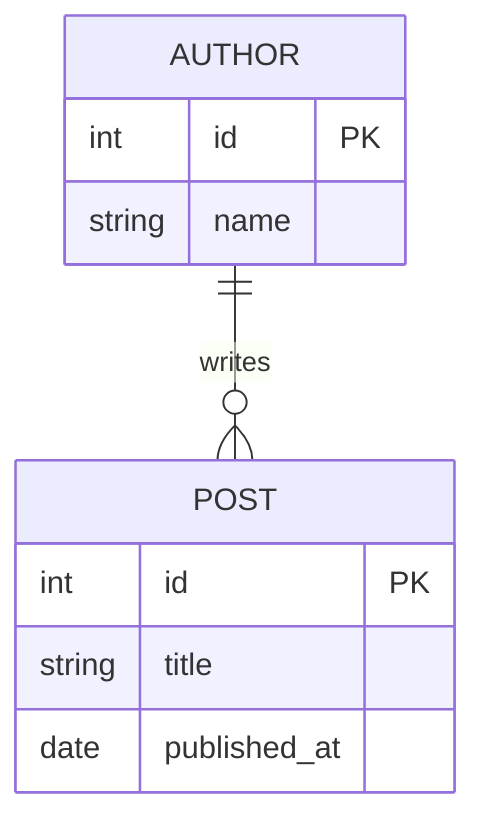
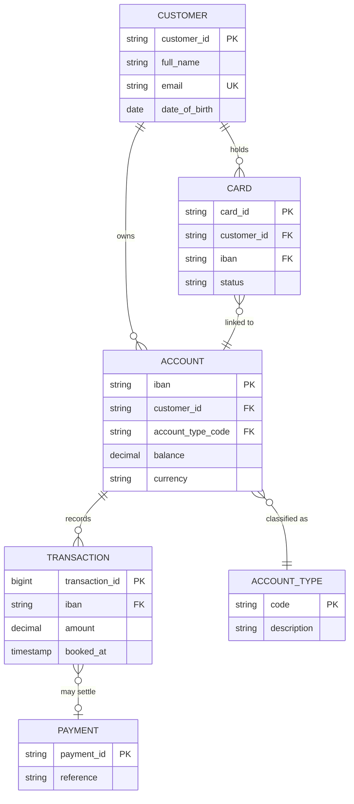

# Entity Relationship Diagram

ER diagrams show database entities, their attributes, and relationships.

## Simple example: blog

```mermaid
erDiagram
    AUTHOR ||--o{ POST : writes
    POST {
        int id PK
        string title
        date published_at
    }
    AUTHOR {
        int id PK
        string name
    }
```

## Complex example: banking schema

```mermaid
erDiagram
    CUSTOMER ||--o{ ACCOUNT : owns
    ACCOUNT ||--o{ TRANSACTION : records
    ACCOUNT }o--|| ACCOUNT_TYPE : "classified as"
    CUSTOMER ||--o{ CARD : holds
    CARD }o--|| ACCOUNT : "linked to"
    TRANSACTION }o--o| PAYMENT : "may settle"

    CUSTOMER {
        string customer_id PK
        string full_name
        string email UK
        date date_of_birth
    }
    ACCOUNT {
        string iban PK
        string customer_id FK
        string account_type_code FK
        decimal balance
        string currency
    }
    ACCOUNT_TYPE {
        string code PK
        string description
    }
    TRANSACTION {
        bigint transaction_id PK
        string iban FK
        decimal amount
        timestamp booked_at
    }
    CARD {
        string card_id PK
        string customer_id FK
        string iban FK
        string status
    }
    PAYMENT {
        string payment_id PK
        string reference
    }
```
