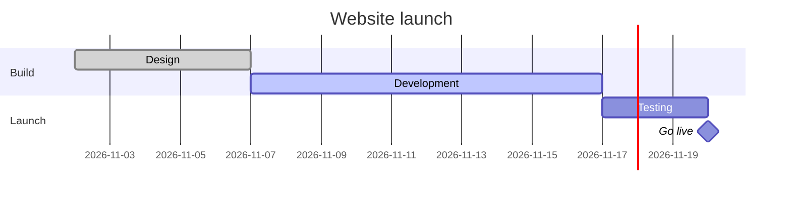
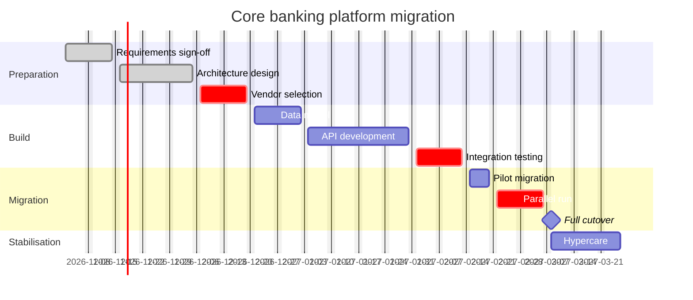

# Gantt Chart

Gantt charts show project schedules, tasks, durations, and dependencies.

## Simple example: website launch

```mermaid
gantt
    title Website launch
    dateFormat YYYY-MM-DD
    section Build
    Design       :done, des, 2026-11-02, 5d
    Development  :active, dev, after des, 10d
    section Launch
    Testing      :test, after dev, 3d
    Go live      :milestone, after test, 0d
```

## Complex example: platform migration

```mermaid
gantt
    title Core banking platform migration
    dateFormat YYYY-MM-DD
    excludes weekends
    section Preparation
    Requirements sign-off     :done, req, 2026-11-02, 10d
    Architecture design       :done, arch, after req, 15d
    Vendor selection          :crit, vendor, after arch, 10d
    section Build
    Data model                :data, after vendor, 10d
    API development           :api, after data, 20d
    Integration testing       :crit, itest, after api, 10d
    section Migration
    Pilot migration           :pilot, after itest, 5d
    Parallel run              :crit, parallel, after pilot, 10d
    Full cutover              :milestone, cutover, after parallel, 0d
    section Stabilisation
    Hypercare                 :hyper, after cutover, 14d
```
