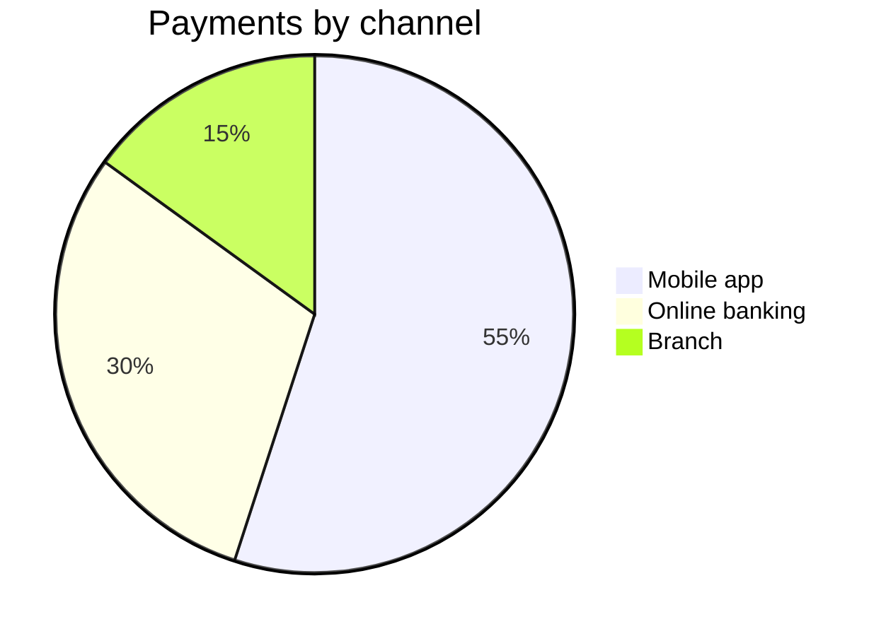
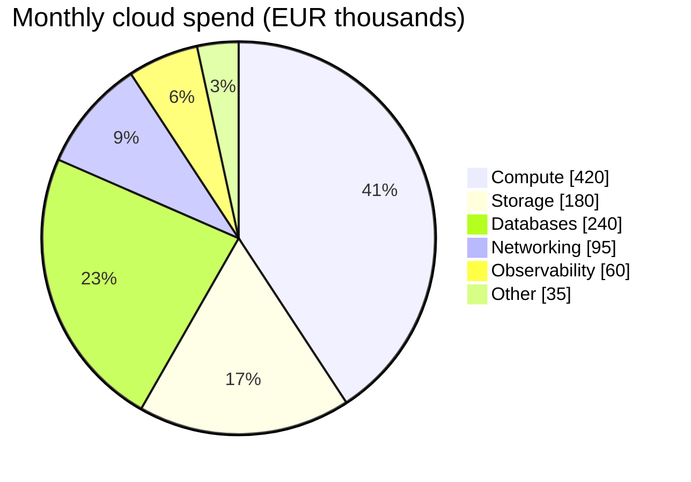

# Pie Chart

Pie charts show proportions of a whole.

## Simple example: channel usage

```mermaid
pie title Payments by channel
    "Mobile app" : 55
    "Online banking" : 30
    "Branch" : 15
```

## Complex example: cloud spend by category

```mermaid
pie showData title Monthly cloud spend (EUR thousands)
    "Compute" : 420
    "Storage" : 180
    "Databases" : 240
    "Networking" : 95
    "Observability" : 60
    "Other" : 35
```
