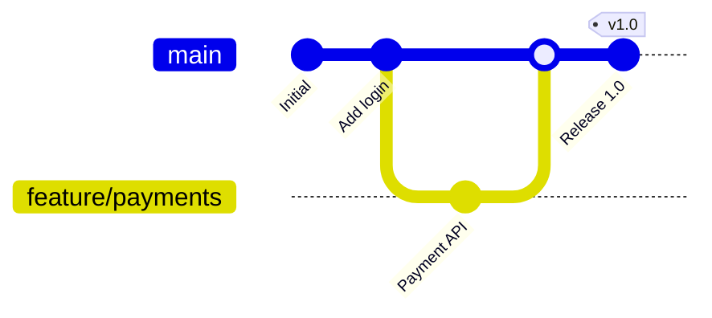
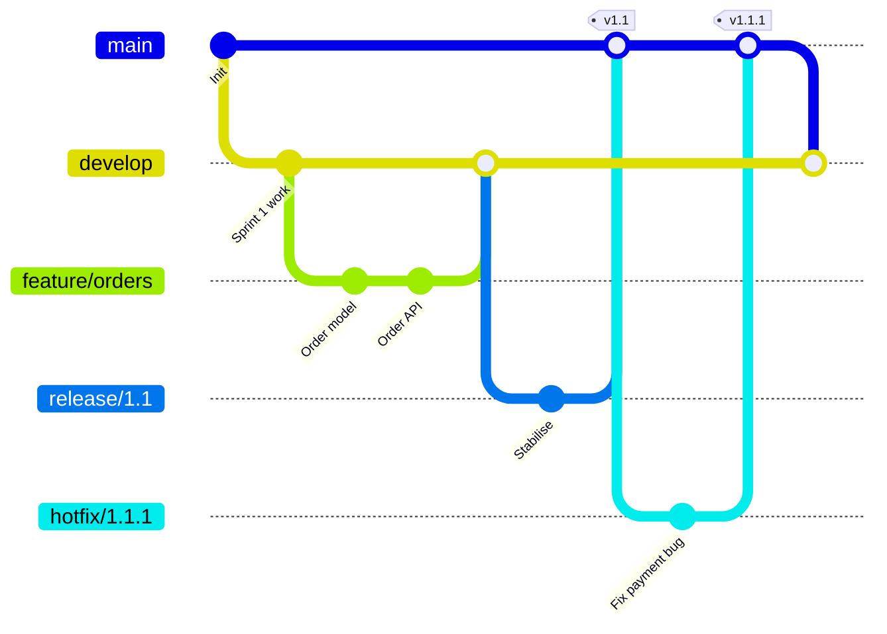

# Git Graph

Git graphs show branches, commits, merges, and tags.

## Simple example: feature branch

```mermaid
gitGraph
    commit id: "Initial"
    commit id: "Add login"
    branch feature/payments
    checkout feature/payments
    commit id: "Payment API"
    checkout main
    merge feature/payments
    commit id: "Release 1.0" tag: "v1.0"
```

## Complex example: release flow with hotfix

```mermaid
gitGraph
    commit id: "Init"
    branch develop
    checkout develop
    commit id: "Sprint 1 work"
    branch feature/orders
    commit id: "Order model"
    commit id: "Order API"
    checkout develop
    merge feature/orders
    branch release/1.1
    checkout release/1.1
    commit id: "Stabilise"
    checkout main
    merge release/1.1 tag: "v1.1"
    checkout main
    branch hotfix/1.1.1
    commit id: "Fix payment bug"
    checkout main
    merge hotfix/1.1.1 tag: "v1.1.1"
    checkout develop
    merge main
```
