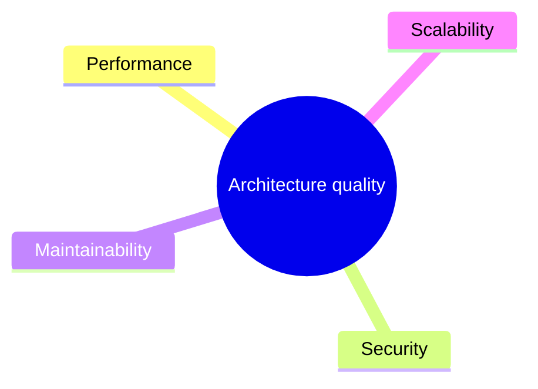
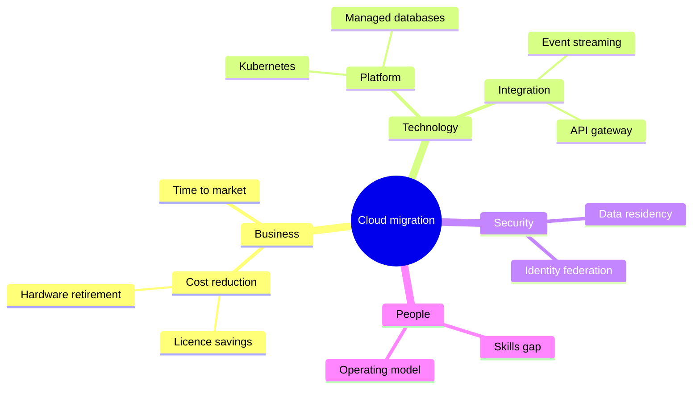

# Mindmap

Mindmaps show hierarchical ideas radiating from a central topic.

## Simple example: architecture qualities

```mermaid
mindmap
  root((Architecture quality))
    Performance
    Security
    Maintainability
    Scalability
```

## Complex example: architecture decision areas

```mermaid
mindmap
  root((Cloud migration))
    Business
      Cost reduction
        Licence savings
        Hardware retirement
      Time to market
    Technology
      Platform
        Kubernetes
        Managed databases
      Integration
        Event streaming
        API gateway
    Security
      ::icon(fa fa-shield)
      Identity federation
      Data residency
    People
      Skills gap
      Operating model
```
