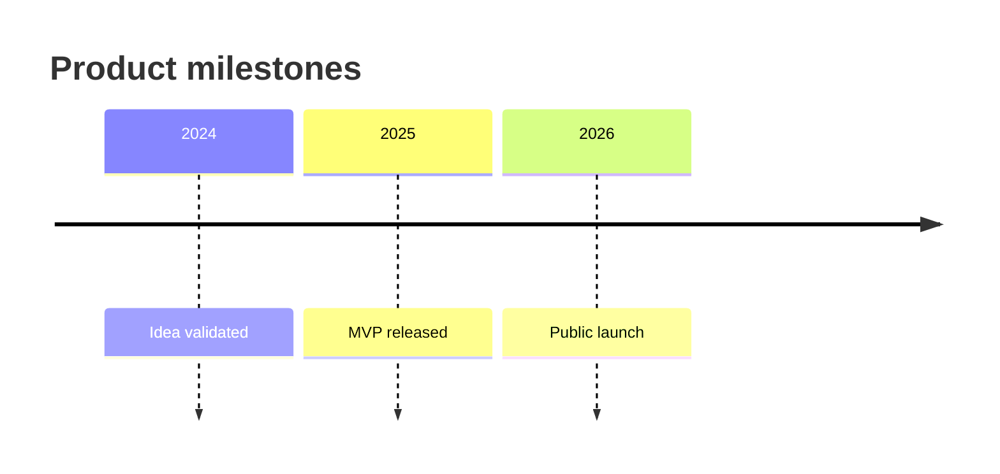
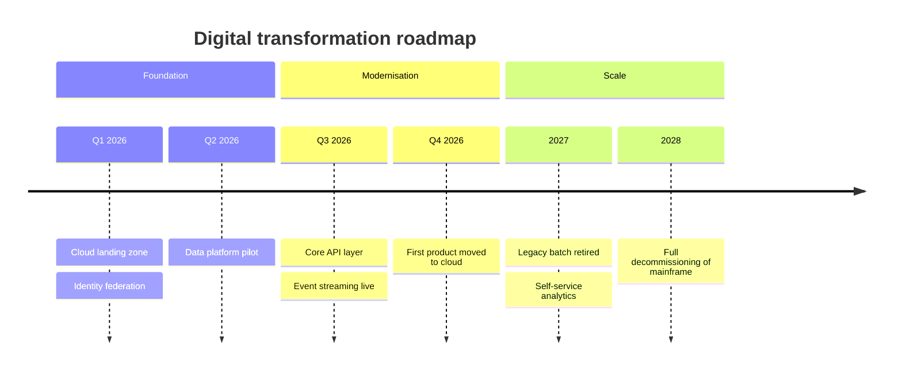

# Timeline

Timelines show events in chronological order, grouped by period.

## Simple example: product milestones

```mermaid
timeline
    title Product milestones
    2024 : Idea validated
    2025 : MVP released
    2026 : Public launch
```

## Complex example: digital transformation roadmap

```mermaid
timeline
    title Digital transformation roadmap
    section Foundation
        Q1 2026 : Cloud landing zone
                : Identity federation
        Q2 2026 : Data platform pilot
    section Modernisation
        Q3 2026 : Core API layer
                : Event streaming live
        Q4 2026 : First product moved to cloud
    section Scale
        2027 : Legacy batch retired
             : Self-service analytics
        2028 : Full decommissioning of mainframe
```
