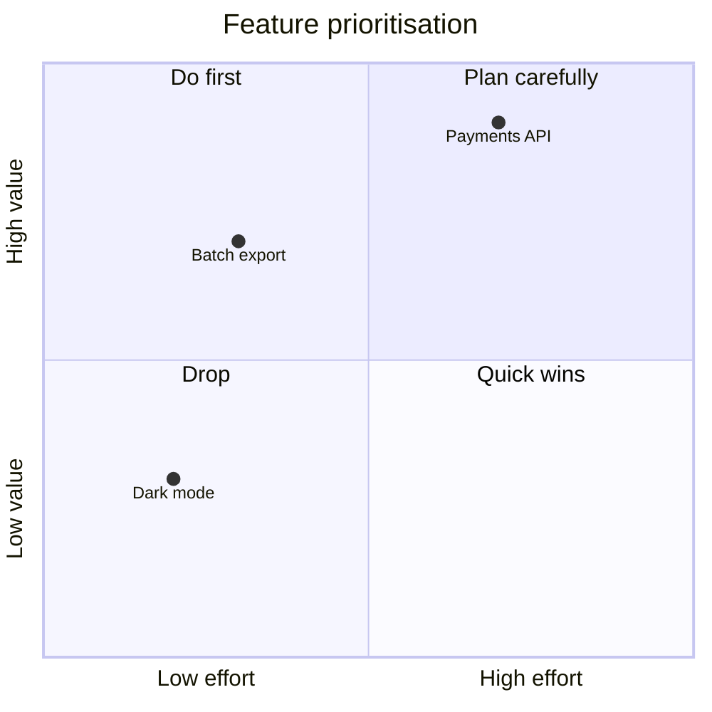
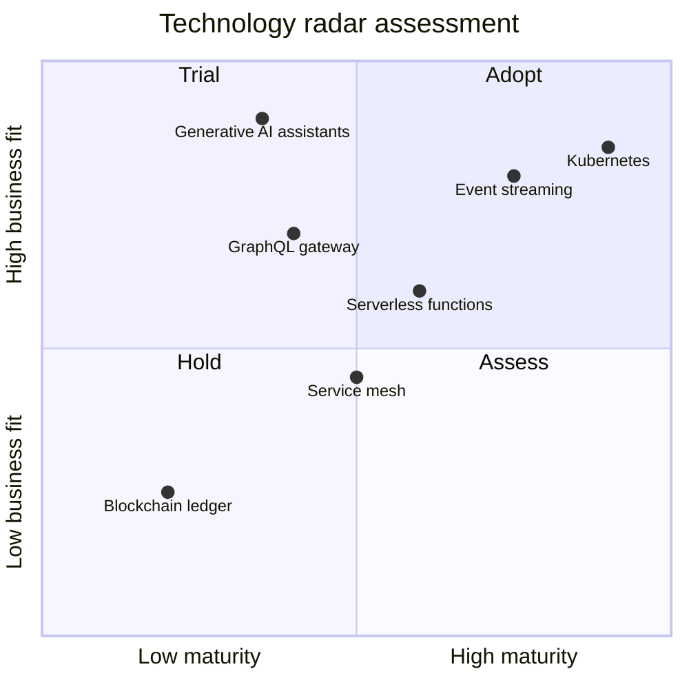

# Quadrant Chart

Quadrant charts place items on a two-axis matrix to compare priorities.

## Simple example: feature prioritisation

```mermaid
quadrantChart
    title Feature prioritisation
    x-axis Low effort --> High effort
    y-axis Low value --> High value
    quadrant-1 Plan carefully
    quadrant-2 Do first
    quadrant-3 Drop
    quadrant-4 Quick wins
    Payments API: [0.7, 0.9]
    Dark mode: [0.2, 0.3]
    Batch export: [0.3, 0.7]
```

## Complex example: technology assessment

```mermaid
quadrantChart
    title Technology radar assessment
    x-axis Low maturity --> High maturity
    y-axis Low business fit --> High business fit
    quadrant-1 Adopt
    quadrant-2 Trial
    quadrant-3 Hold
    quadrant-4 Assess
    Kubernetes: [0.9, 0.85]
    Service mesh: [0.5, 0.45]
    Event streaming: [0.75, 0.8]
    Serverless functions: [0.6, 0.6]
    Blockchain ledger: [0.2, 0.25]
    GraphQL gateway: [0.4, 0.7]
    Generative AI assistants: [0.35, 0.9]
```
