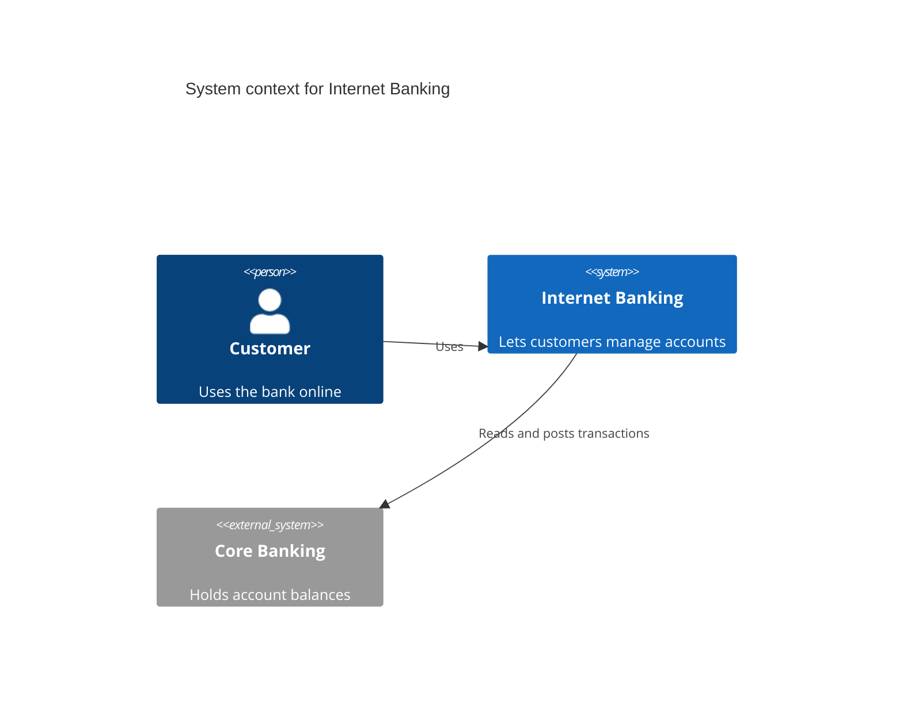
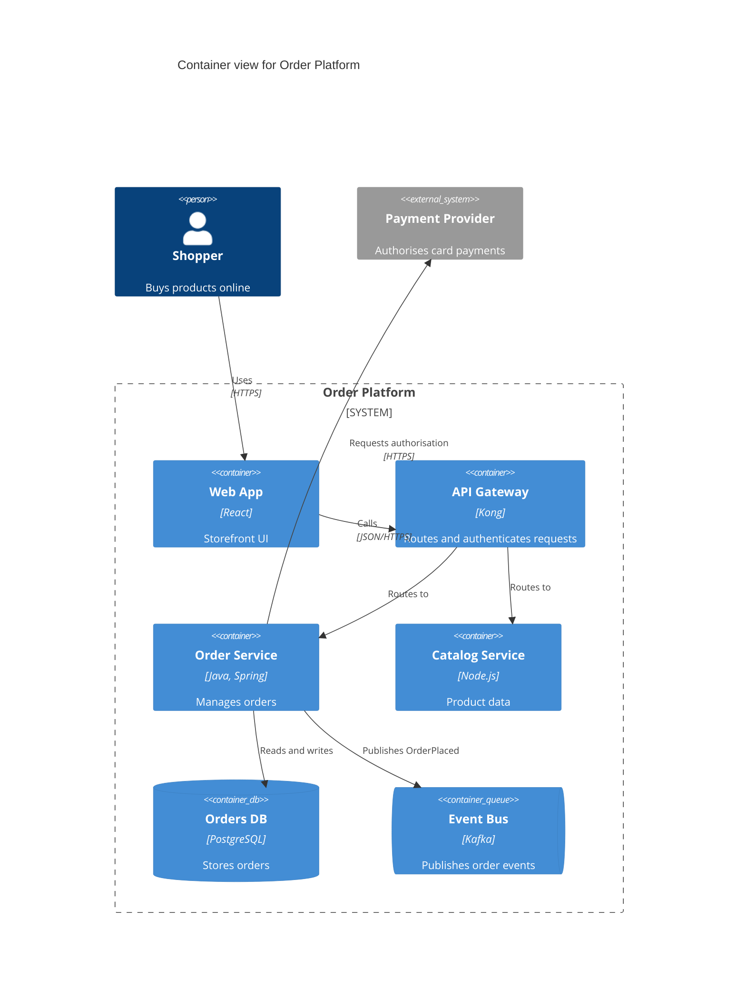

# C4 Diagram

C4 diagrams show software architecture at context, container, and component levels.

## Simple example: system context

```mermaid
C4Context
    title System context for Internet Banking
    Person(customer, "Customer", "Uses the bank online")
    System(banking, "Internet Banking", "Lets customers manage accounts")
    System_Ext(core, "Core Banking", "Holds account balances")
    Rel(customer, banking, "Uses")
    Rel(banking, core, "Reads and posts transactions")
```

## Complex example: container view

```mermaid
C4Container
    title Container view for Order Platform
    Person(shopper, "Shopper", "Buys products online")
    System_Ext(payment, "Payment Provider", "Authorises card payments")

    System_Boundary(platform, "Order Platform") {
        Container(web, "Web App", "React", "Storefront UI")
        Container(api, "API Gateway", "Kong", "Routes and authenticates requests")
        Container(orders, "Order Service", "Java, Spring", "Manages orders")
        Container(catalog, "Catalog Service", "Node.js", "Product data")
        ContainerDb(db, "Orders DB", "PostgreSQL", "Stores orders")
        ContainerQueue(bus, "Event Bus", "Kafka", "Publishes order events")
    }

    Rel(shopper, web, "Uses", "HTTPS")
    Rel(web, api, "Calls", "JSON/HTTPS")
    Rel(api, orders, "Routes to")
    Rel(api, catalog, "Routes to")
    Rel(orders, db, "Reads and writes")
    Rel(orders, bus, "Publishes OrderPlaced")
    Rel(orders, payment, "Requests authorisation", "HTTPS")
```
