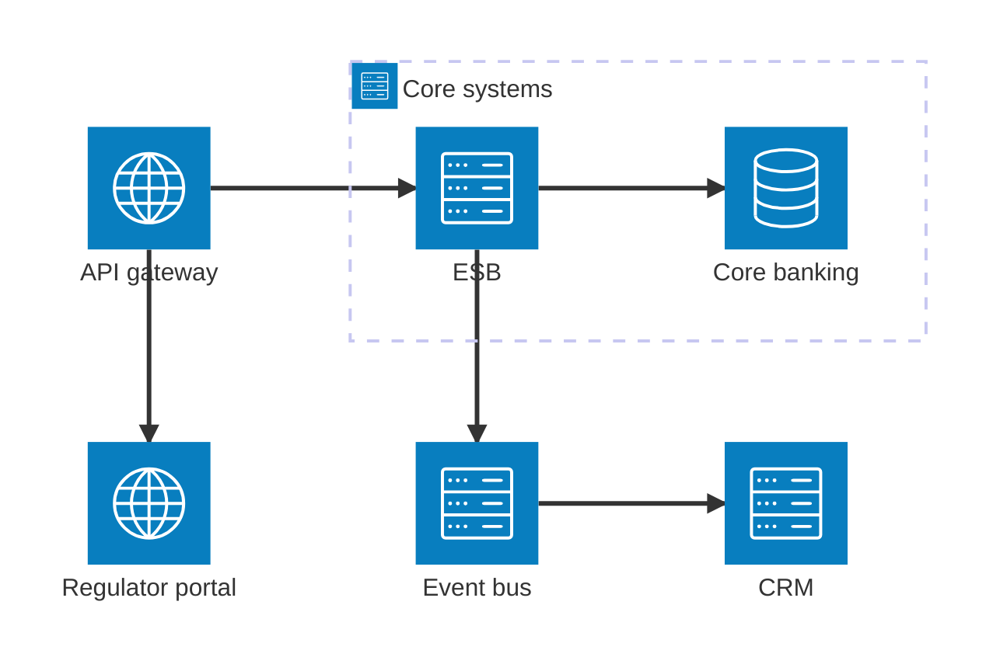

# Integration Architecture

Mermaid type: `architecture-beta` (beta). Shows systems, middleware, and integration paths.

```mermaid
architecture-beta
    group core(server)[Core systems]

    service cbs(database)[Core banking] in core
    service esb(server)[ESB] in core
    service gw(internet)[API gateway]
    service crm(server)[CRM]
    service bus(server)[Event bus]
    service reg(internet)[Regulator portal]

    gw:R --> L:esb
    esb:R --> L:cbs
    esb:B --> T:bus
    bus:R --> L:crm
    gw:B --> T:reg
```
