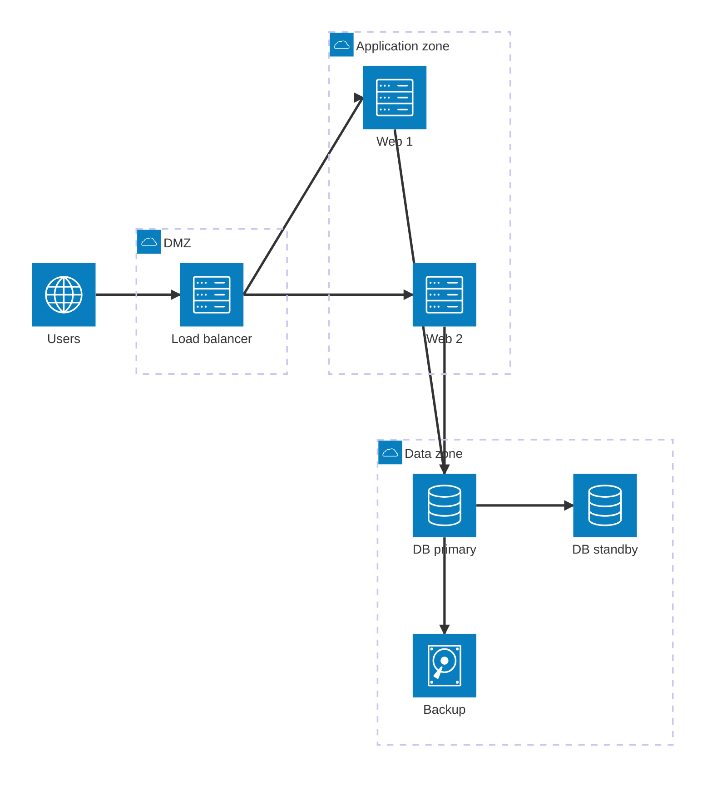

# Infrastructure Topology

Mermaid type: `architecture-beta` (beta). Shows tiers, load balancing, and database replication.

```mermaid
architecture-beta
    group dmz(cloud)[DMZ]
    group app(cloud)[Application zone]
    group data(cloud)[Data zone]

    service users(internet)[Users]
    service lb(server)[Load balancer] in dmz
    service web1(server)[Web 1] in app
    service web2(server)[Web 2] in app
    service db1(database)[DB primary] in data
    service db2(database)[DB standby] in data
    service backup(disk)[Backup] in data

    users:R --> L:lb
    lb:R --> L:web1
    lb:R --> L:web2
    web1:B --> T:db1
    web2:B --> T:db1
    db1:R --> L:db2
    db1:B --> T:backup
```
