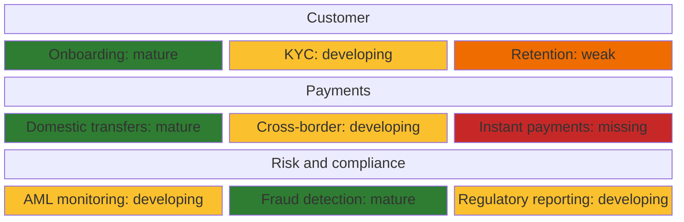

# Capability Map

Mermaid type: `block-beta` (beta). Grid of L1 capabilities with L2 items colored by maturity.

```mermaid
block-beta
    columns 3
    l1a["Customer"]:3
    a1["Onboarding: mature"] a2["KYC: developing"] a3["Retention: weak"]
    l1b["Payments"]:3
    b1["Domestic transfers: mature"] b2["Cross-border: developing"] b3["Instant payments: missing"]
    l1c["Risk and compliance"]:3
    c1["AML monitoring: developing"] c2["Fraud detection: mature"] c3["Regulatory reporting: developing"]

    classDef mature fill:#2e7d32,color:#fff
    classDef developing fill:#fbc02d
    classDef weak fill:#ef6c00,color:#fff
    classDef missing fill:#c62828,color:#fff
    class a1,b1,c2 mature
    class a2,b2,c1,c3 developing
    class a3 weak
    class b3 missing
```
