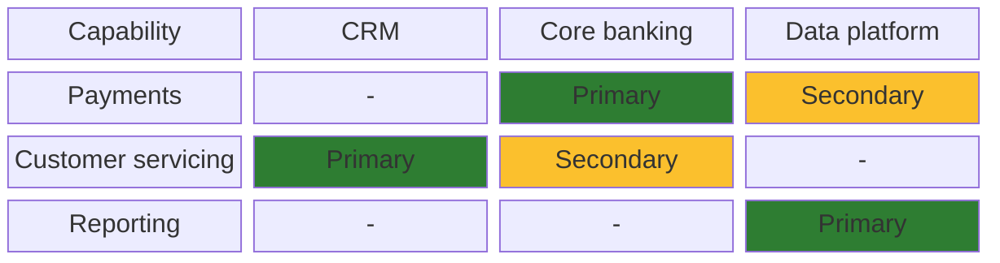

# Business–Application Alignment

Mermaid type: `block-beta` (beta). Grid of capabilities against applications, marking the primary and secondary support.

```mermaid
block-beta
    columns 4
    h0["Capability"] h1["CRM"] h2["Core banking"] h3["Data platform"]
    r1["Payments"] p1["-"] p2["Primary"] s1["Secondary"]
    r2["Customer servicing"] p3["Primary"] s2["Secondary"] p4["-"]
    r3["Reporting"] p5["-"] p6["-"] s3["Primary"]

    classDef primary fill:#2e7d32,color:#fff
    classDef secondary fill:#fbc02d
    class p2,p3,s3 primary
    class s1,s2 secondary
```
