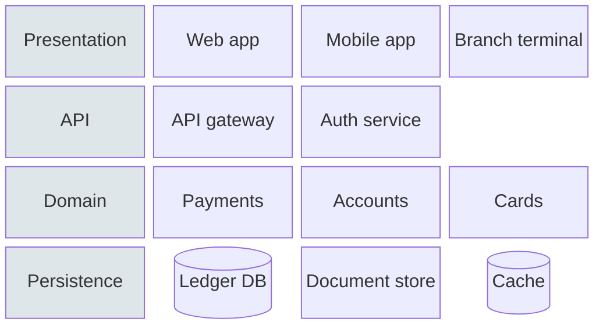

# Layered Architecture

Mermaid type: `block-beta` (beta). Stacked layers with components in each layer.

```mermaid
block-beta
    columns 4
    lp["Presentation"] web["Web app"] mobile["Mobile app"] branch["Branch terminal"]
    la["API"] gateway["API gateway"] auth["Auth service"] space
    ld["Domain"] payments["Payments"] accounts["Accounts"] cards["Cards"]
    li["Persistence"] ledger[("Ledger DB")] docs["Document store"] cache[("Cache")]

    classDef layer fill:#dfe6e9,color:#000
    class lp,la,ld,li layer
```
