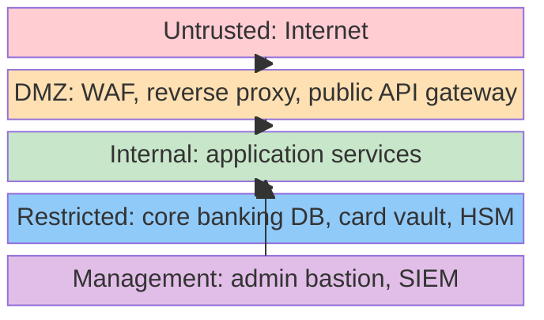

# Security Zones

Mermaid type: `block-beta` (beta). Network zones ordered by trust level with allowed flows.

```mermaid
block-beta
    columns 1
    z1["Untrusted: Internet"]
    z2["DMZ: WAF, reverse proxy, public API gateway"]
    z3["Internal: application services"]
    z4["Restricted: core banking DB, card vault, HSM"]
    z5["Management: admin bastion, SIEM"]

    z1 --> z2
    z2 --> z3
    z3 --> z4
    z5 --> z3

    classDef untrusted fill:#ffcdd2,color:#000
    classDef dmz fill:#ffe0b2,color:#000
    classDef internal fill:#c8e6c9,color:#000
    classDef restricted fill:#90caf9,color:#000
    classDef mgmt fill:#e1bee7,color:#000
    class z1 untrusted
    class z2 dmz
    class z3 internal
    class z4 restricted
    class z5 mgmt
```
