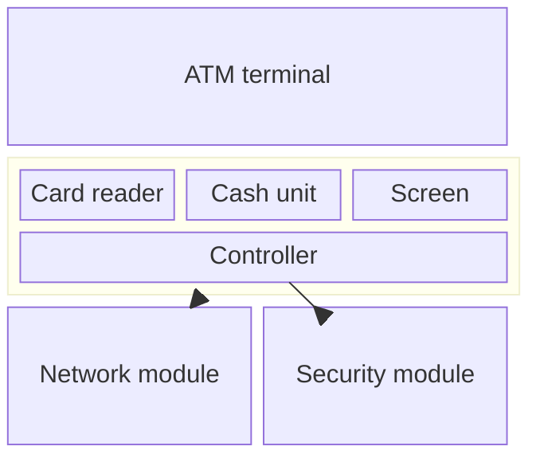

# Composite Structure

Mermaid type: `block-beta` (beta). Nested blocks showing parts inside a composite system.

```mermaid
block-beta
    columns 2
    atmTitle["ATM terminal"]:2
    block:atm:2
        columns 3
        reader["Card reader"] cash["Cash unit"] screen["Screen"]
        ctrl["Controller"]:3
    end
    net["Network module"] sec["Security module"]

    atm --> net
    ctrl --> sec
```
