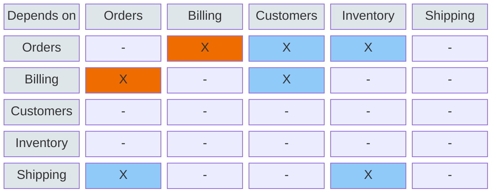

# Dependency Structure Matrix

Mermaid type: `block-beta` (beta). Grid of service dependencies; the orange cells mark a cycle between Orders and Billing.

```mermaid
block-beta
    columns 6
    h0["Depends on"] h1["Orders"] h2["Billing"] h3["Customers"] h4["Inventory"] h5["Shipping"]
    r1["Orders"] c11["-"] c12["X"] c13["X"] c14["X"] c15["-"]
    r2["Billing"] c21["X"] c22["-"] c23["X"] c24["-"] c25["-"]
    r3["Customers"] c31["-"] c32["-"] c33["-"] c34["-"] c35["-"]
    r4["Inventory"] c41["-"] c42["-"] c43["-"] c44["-"] c45["-"]
    r5["Shipping"] c51["X"] c52["-"] c53["-"] c54["X"] c55["-"]

    classDef dep fill:#90caf9,color:#000
    classDef cycle fill:#ef6c00,color:#fff
    classDef header fill:#dfe6e9,color:#000
    class c13,c14,c23,c51,c54 dep
    class c12,c21 cycle
    class h0,h1,h2,h3,h4,h5,r1,r2,r3,r4,r5 header
```
