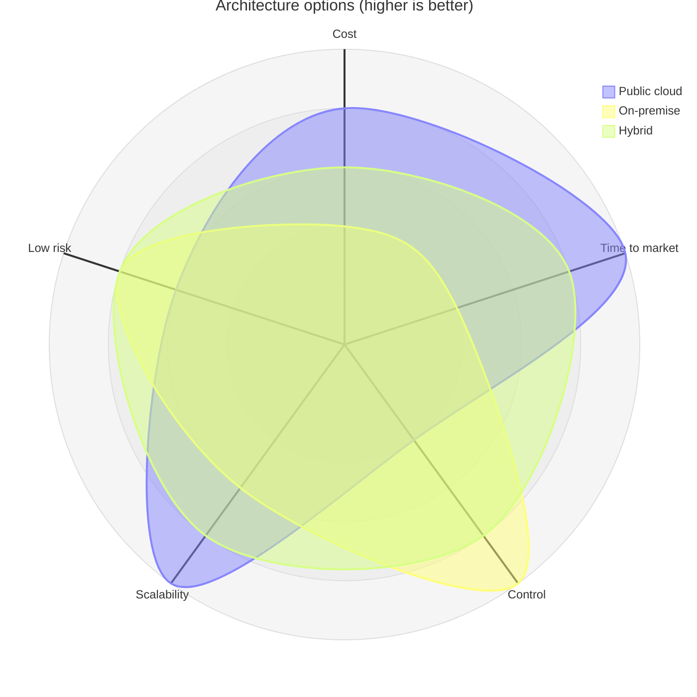

# Trade-off Radar

Mermaid type: `radar-beta` (beta). Compares three architecture options across five quality attributes (scores 1-5).

```mermaid
radar-beta
    title Architecture options (higher is better)
    axis cost["Cost"], speed["Time to market"], control["Control"], scale["Scalability"], risk["Low risk"]
    curve cloud["Public cloud"]{4, 5, 2, 5, 3}
    curve onprem["On-premise"]{2, 2, 5, 3, 4}
    curve hybrid["Hybrid"]{3, 4, 4, 4, 4}
    max 5
    min 0
```
