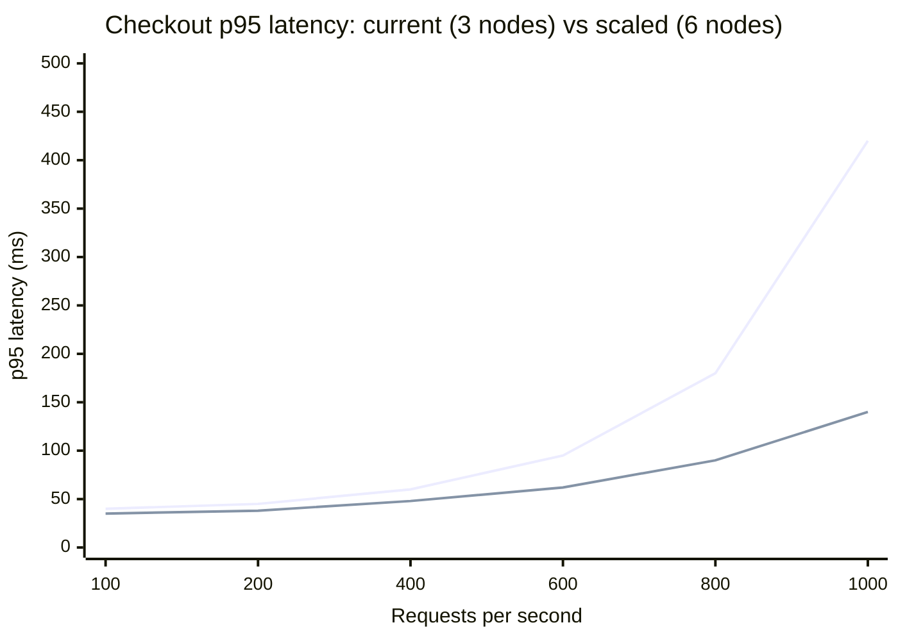

# Capacity and Queuing

Mermaid type: `xychart-beta` (beta). Shows p95 latency against load for the current and scaled setups.

```mermaid
xychart-beta
    title "Checkout p95 latency: current (3 nodes) vs scaled (6 nodes)"
    x-axis "Requests per second" [100, 200, 400, 600, 800, 1000]
    y-axis "p95 latency (ms)" 0 --> 500
    line [40, 45, 60, 95, 180, 420]
    line [35, 38, 48, 62, 90, 140]
```
